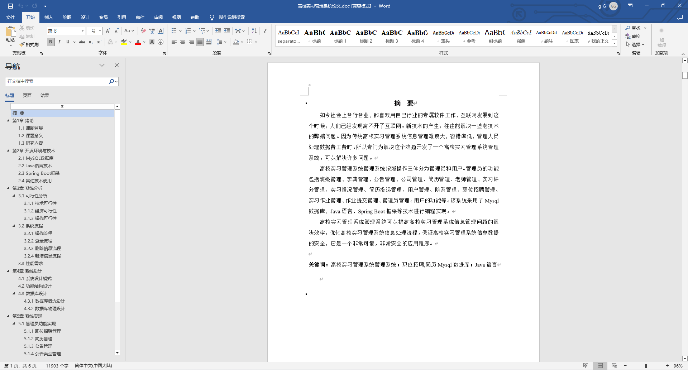
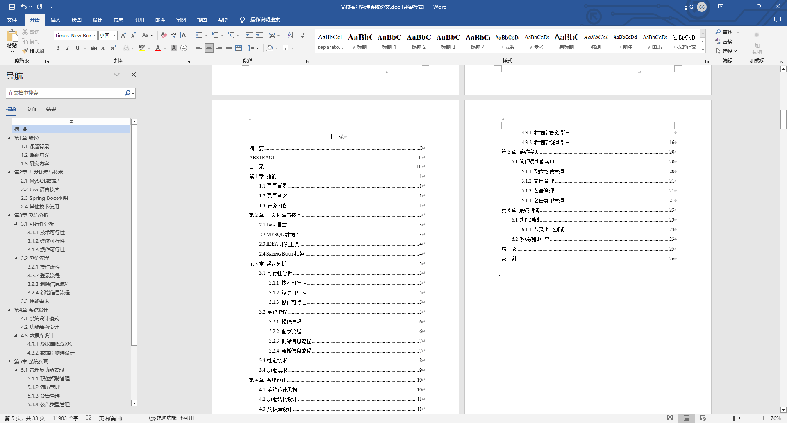
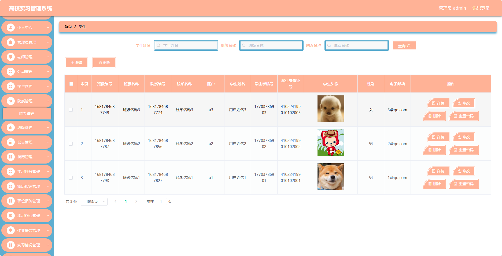
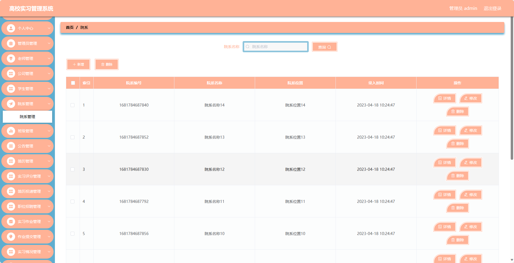
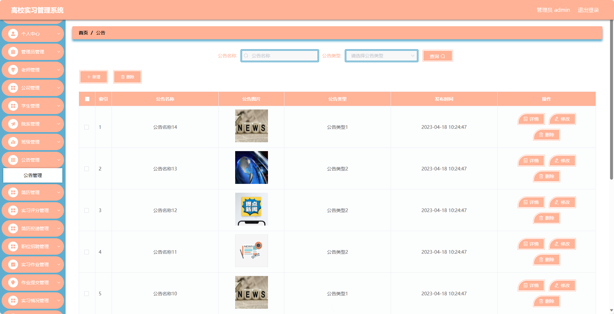
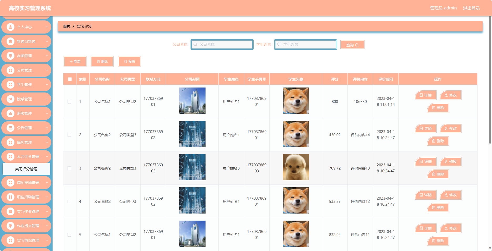
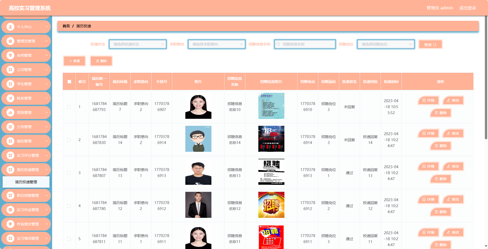
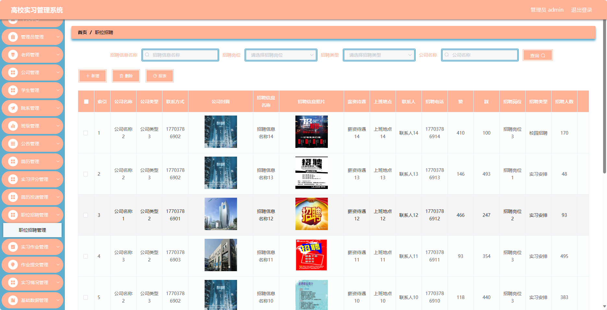
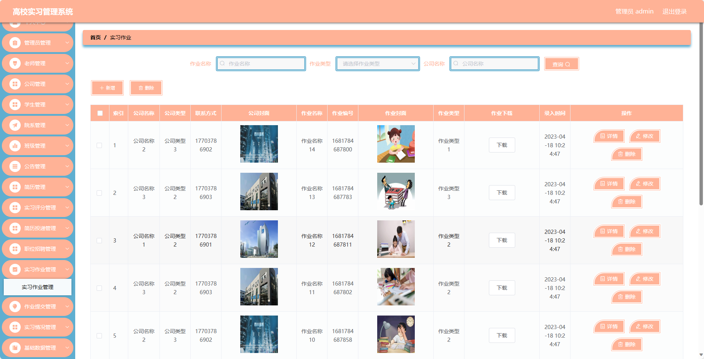
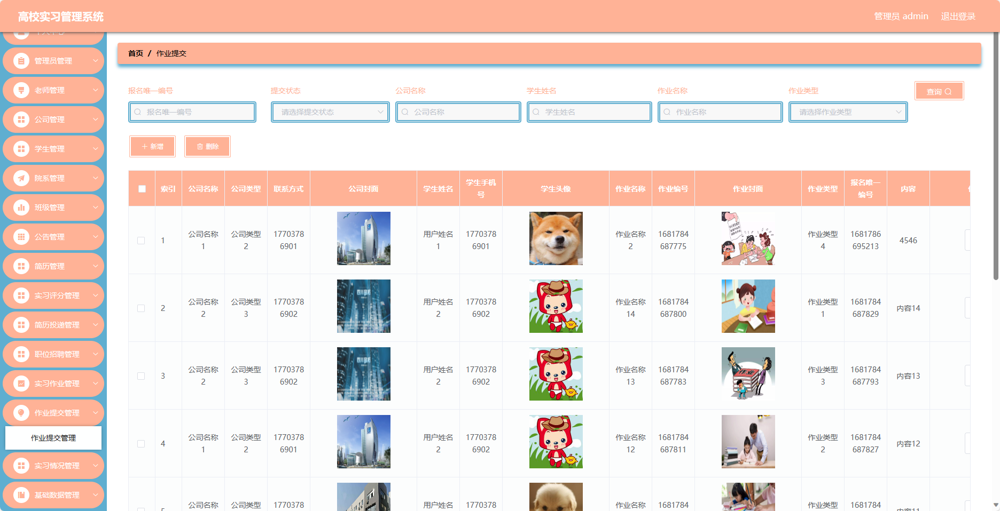

基于Springboot的高校实习管理系统（程序+论文）
=
### 完整代码获取地址：从戎源码网 ([https://armycodes.com/](https://armycodes.com/))
### 作者微信：19941326836  QQ：952045282 
### 承接计算机毕业设计、Java毕业设计、Python毕业设计、深度学习、机器学习
### 选题+开题报告+任务书+程序定制+安装调试+论文+答辩ppt 一条龙服务
### 所有选题地址https://github.com/nature924/allProject

一、项目介绍
---
基于Spring Boot框架实现的高校实习管理系统，系统包含四种角色：管理员、公司、用户,主要功能如下。

### 管理员功能：
- 个人中心：管理个人信息。
- 管理员管理：管理系统管理员信息。
- 老师管理：管理教师信息。
- 公司管理：管理实习公司信息。
- 学生管理：管理学生信息。
- 院系管理：管理院系信息。
- 班级管理：管理班级信息。
- 公告管理：发布和管理系统公告。
- 简历管理：管理学生的实习简历。
- 实习评分管理：对学生实习进行评分管理。
- 简历投递管理：管理学生的简历投递情况。
- 职位招聘管理：发布和管理实习职位招聘信息。
- 实习作业管理：管理学生的实习作业。
- 作业提交管理：管理学生的作业提交情况。
- 实习情况管理：跟踪和管理学生的实习情况。
- 基础数据管理：管理系统的基础数据。

### 老师功能：
- 个人中心：管理个人信息。
- 学生管理：管理指导的学生信息。
- 院系管理：管理所属院系信息。
- 班级管理：管理所属班级信息。
- 公告管理：发布和管理班级公告。
- 简历管理：管理学生的实习简历。
- 实习情况管理：跟踪和管理学生的实习情况。
- 实习评分管理：对学生实习进行评分管理。
- 职位招聘管理：发布和管理实习职位招聘信息。

### 公司功能：
- 个人中心：管理个人信息。
- 学生管理：管理实习学生信息。
- 公告管理：发布和管理公司公告。
- 实习评分管理：对实习学生进行评分管理。
- 简历投递管理：管理学生的简历投递情况。
- 职位招聘管理：发布和管理实习职位招聘信息。
- 实习作业管理：管理学生的实习作业。
- 作业提交管理：管理学生的作业提交情况。

### 学生功能：
- 个人中心：管理个人信息。
- 院系管理：管理所属院系信息。
- 班级管理：管理所属班级信息。
- 公告管理：查看和管理公告信息。
- 简历管理：管理个人的实习简历。
- 实习情况管理：查看和管理自己的实习情况。
- 实习评分管理：查看和管理自己的实习评分。
- 简历投递管理：管理个人简历的投递情况。
- 职位招聘管理：查看和申请实习职位。
- 实习作业管理：查看和提交实习作业。
- 作业提交管理：查看和管理作业提交情况。

二、项目技术
---
- 编程语言：Java
- 数据库：MySQL
- 项目管理工具：Maven
- 前端技术：VUE、HTML、Jquery、Bootstrap
- 后端技术：Spring、SpringMVC、MyBatis

三、运行环境
---
- 操作系统：Windows、macOS都可以
- JDK版本：JDK1.8以上都可以
- 开发工具：IDEA、Ecplise、Myecplise都可以
- 数据库: MySQL5.7以上都可以
- Tomcat：任意版本都可以
- Maven：任意版本都可以

四、运行截图
---
### 论文截图：

### 程序截图：

